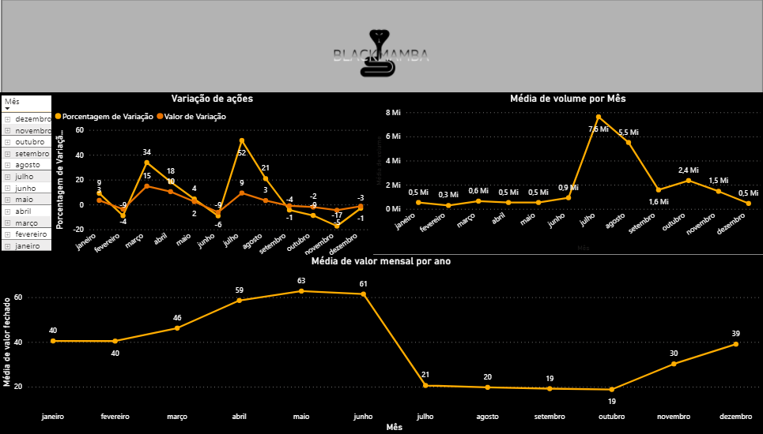
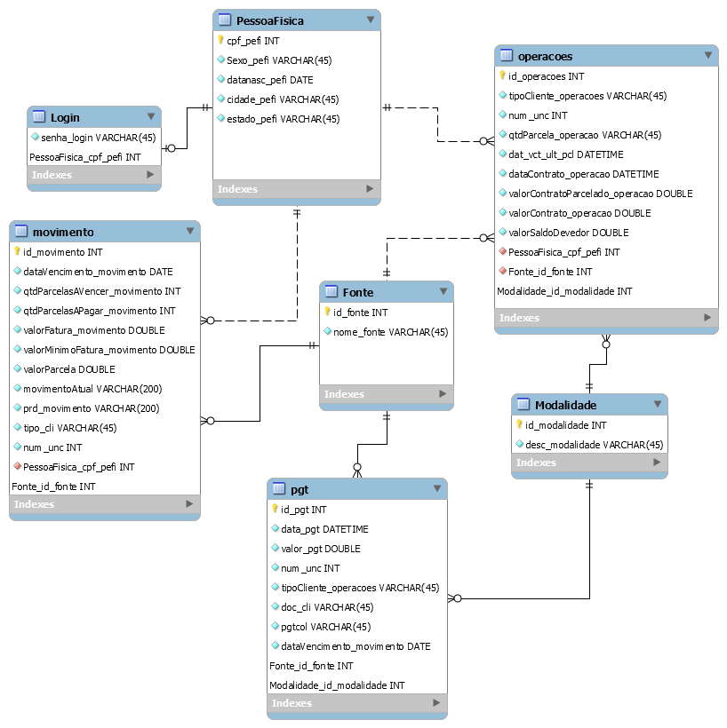

### Arthur Cardoso Rinaldi da Silva

# Ola sou Arthur
Estudante de Banco de Dados, escritor online e estas são minhas experiências na Fatec de Sâo José dos Campos.

# Meus Projetos.

## Em 2019-2
### Descrição:
No primeiro semestre como projeto do API, foi proposto o desenvolvimento de um web bot.
O webotbot "black mamba" tinha como seu objetivo fazer a busca de variação de uma ação no mercado financeiro, afim de entregar ao usuario um momento oportuno para ser feita a compra.
Para isso o bot irá capturar os dados em tempo real do valor de uma ação e comparar com os históricos de variações dessa mesma ação em outros períodos em conjunto com uma mapeamento das notícias que podem influenciar o valor da ação.
O sistema também possuia uma interface vinculada ao power bi, para tornar de forma mais visivel para o usuario como anda a variação da ação e seu historico, alem disso também existia a opção de fazer login pelo telegram.

### Tecnologias: 

* Python 3.7 - Foi escolhido como Linguagem principal pois tinha uma rapida evolução de aprendizado, e como sabiamos que seria necessario uma integração com graficos, a biblioteca "pandas" sairia como uma grande ajuda.
* Zen of Python - Foi passado pelos alunos do 6 semestre para aprendermos mais sobre boas práticas para o Projeto;
* Visual Studio Code - IDE;
* Power Bi - Foi escolhido por ser ser facil de utilizar e ter uma boa evolução de aprendizado;
* MySQL - Foi escolhido por ser o banco de maior conhecimento do grupo;
* Conceitos do SCRUM - Norteador do Projeto.
* Principais Bibliotecas Python:  
    **PyMySQL** - interação com nosso Banco de Dados;  
    **Selenium** - navegação pela Web através do WebDriver do Google Chrome;  
    **Beautiful Soup** - interação com o html dos sites para permitir as raspagens de dados;  
    **Pandas / Matplotlib** - ferramentas para gerar e plotar graficos;  
    **Email / Telegram-bot** - envio de alertas e notificações;
    
 ###  - Contribuições individuais: 

* Tornando o arquivo "executavel.py" executavel.
```python
import sys
from cx_Freeze import setup, Executable
import Classificacao
base = None
if sys.platform == "win64":
    base = "Win64GUI"
Executables = [
    Executable("Classificacao.py", base=base)
]
buildOptions = dict(
    packages = [],
    includes = ["Classificacao"],
    include_files = [],
    excludes = []
)
setup(
    name = "Classificacao",
    version="1.0",
    description = "Espero que funcione",
    options = dict(build_exe = buildOptions),
    Executables = Executables
)
```
Para tornar o arquivo executavel foi utilizado a biblioteca "cx_Freeze".


* Classificacao.py
```python
from selenium import webdriver
from selenium.webdriver.chrome.options import Options
from bs4 import BeautifulSoup
import pymysql
import time
from datetime import datetime
from alert import hahaha
cont = int(1)
trigger_email = []
wait =int(10) # Trocar aqui os tempos de espera - mudar para rodar na FATEC devido a INTERNET lenta
options = Options()
options.add_argument('--headless')
options.add_argument('--disable-gpu')
ff = webdriver.Chrome(options=options)
ff.get('https://economia.uol.com.br/')
while (True):
    while (datetime.now().hour <= 22 and datetime.now().hour >= 10):
        print ('Iniciando',cont,'º coleta')
        time.sleep(wait)
        html=ff.page_source
        soup=BeautifulSoup(html,"html.parser")
        time.sleep(2)
        ##-----------------------------------##
        filtro1 = soup.find_all(class_='tv-symbol-price-quote__value js-symbol-last')
        filtro1 = (filtro1[0].text.replace('−','-'))
        trigger_email.append(filtro1)
        ##-----------------------------------
        filtro2 = soup.find_all(class_='js-symbol-change tv-symbol-price-quote__change-value')
        filtro2 = (filtro2[0].text.replace('−','-'))
        ##-----------------------------------
        filtro3 = soup.find_all(class_='js-symbol-change-pt tv-symbol-price-quote__change-value')
        filtro3 = (filtro3[0].text[1:-1].replace('−','-'))
        print (filtro1," / ",filtro2," / ",filtro3,"\n")
       # print("----------------------------------")
        ###Armazenando link com noticias na variavel noticia.
        noticia=soup.find_all("a",{"class": "tv-widget-news tv-widget-news--link js-widget-news-link js-ga-track-news-escape"})
        cont = cont +1
        ff.refresh()
        # 
        connection = pymysql.connect(host='bvzfdagnfqepipz70gyw-mysql.services.clever-cloud.com',
                                     port=3306,
                                     user='ufgpsjx1cswrmye3',
                                     password='ZoKM7HXwAaZAgd9ugpTr')
 
        cursor = connection.cursor()
        cursor.execute("INSERT INTO bvzfdagnfqepipz70gyw.Valor_acoes(Value, IncDec, Variation) VALUES('%s', '%s', '%s')" %(filtro1,filtro2,filtro3))
        cursor.execute("SELECT email FROM bvzfdagnfqepipz70gyw.Usuario")
        q_result = list(cursor.fetchall())
        connection.commit()
        connection.close()
        to_addrs = '' # q_result[0:1].
        for x in list(q_result):
            to_addrs += ''.join(x)
            to_addrs += ''.join('; ')
        if trigger_email[-1:] == trigger_email[-2:-1] and trigger_email[-2:-1] == trigger_email[-3:-2]:
            hahaha("Alerta: Ação do Inter MUITO valorizada","Cara, compra logo",to_addrs)
            print("Alerta Enviado: Compra Logo")
        else:
            if trigger_email[-1:] == trigger_email[-2:-1]:
                hahaha("Alerta: Ação do Inter valorizada", "Hora de Comprar",to_addrs)
                print("Alerta Enviado: Compra 1")
```
O classificação.py tinha a função de fazer a coleta de dados do site, armazenar esses dados coletados.
Também envia para o email do usuario informações sobre o quão interessantes as informações estão para o usuário.


Aqui segue uma amostra da interface usada no projeto, nela é possivel filtrar os graficos por mês e por dia.
No gráfico existem 3 gráficos, variação de ações, média de volume por mês e média de valor mensal por ano.
todos esses dados sendo retirados do banco de dados.


### - Hard Skills:
* Python
* Power bi
* MySql
* Scrum
 
###  - Soft Skills: 
*  Proatividade
*  Autonomia
*  Organização

 
## Em 2020-1 

### Descrição
A proposta do projeto é criar uma interface que permita o usuário cadastrar todos os aspectos de seu ambiente de desenvolvimento (pessoas, projetos, tarefas) fazendo com que por meio de uma interface pratica e interativa o usuário consiga elaborar e analisar cenários referente ao planejamento de seu dia-a-dia, orquestrando pessoas, projetos e horas disponíveis de desenvolvimento para potencializar suas entregas.   
Definimos nosso MVP (Minimum Viable Product) como sendo:  

> Permitir que o usuário cadastre todos os aspectos de seu ambiente de desenvolvimento (pessoas, projetos, tarefas) e permitir por meio de uma interface pratica e interativa (drag and drop) que o usuário consiga elaborar e analisar cenários referente ao planejamento de seus projetos e horas disponiveis de desenvolvimento.

### Tecnologias: 

*  Python 3.7 - Linguagem principal - Foi escolhida pelo fator de conhecimento do grupo sobre a linguagem.
*  frappe.io - biblioteca que foi utilizada para criação dos graficos na interface.
*  FrameWork Django 3 - interface WEB - Foi escolhido por ser o framework web de python mais  conhecido.
*  MySQL - Banco de Dados 
*  Conceitos do SCRUM - Norteador do Projeto 
*  Zen of Python - boas práticas para o Projeto  

### Contribuições individuais: 

* extração do banco para salvar no excel
``` python
@login_required
def import_excel(request):
    
        if request.method == 'POST':
            projeto_resource = ProjetoResource()
            dataset = Dataset()
            new_project = request.FILES['myfile']
            imported_data = dataset.load(new_project.read(),format='xlsx')
            #print(imported_data)
            #nome = dataset[0][0]
            #print(nome)
            connection = pymysql.connect(host='localhost',
                             user='bridges_dev',
                             password='123456',
                             db='bridges',
                             charset='utf8mb4',
                             cursorclass=pymysql.cursors.DictCursor)
            for data in imported_data:
                Nprojeto = data[0]
                DescTarefa = data[1]
                HoraTarefa = data[2]
                MinTarefa = data[3]
                try:
                    with connection.cursor() as cursor:
                        sql = "INSERT INTO `bridges_app_projetos` (nom_pro) VALUES (%s)"
                        cursor.execute(sql, (Nprojeto))
                        connection.commit()
                        sql = "select id_pro from bridges_app_projetos where nom_pro = %s order by id_pro limit 1"
                        cursor.execute(sql, (Nprojeto))
                        result = cursor.fetchone()
                        print(result["id_pro"])
                        
                        sql = "INSERT INTO `bridges_app_tarefas` (nom_tar, fk_pro_id, dur_tar_min, dur_tar_hours) VALUES (%s, %s, %s, %s)"
                        print(sql)
                        idpro = result["id_pro"]
                        cursor.execute(sql, (DescTarefa, idpro , MinTarefa, HoraTarefa))
                        connection.commit()
                        messages.success(request, 'Excel importado com Sucesso!')
                except:
                    print(":(")
            
            connection.close()
        return render(request, 'bridges_app/import_excel.html')
```
Primeiro era feito o import do excel na variavel "imported_data", após isso abria a conexão com o banco atribuindo suas credenciais, feito isso existe um for com a varial "imported_data", dentro desse for existem 4 variaveis Nprojeto, DescTarefa, HoraTarefa, MinTarefa. essas variaveis recebiam o valor dos campos do excel atraves do data[numero da coluna].
Após isso é feito a inserção do que foi retirado do excel ao banco.

* Tela de Cadastro de Funcionarios.
```html
<!DOCTYPE html>
<html lang="pt-br">
  <head>
    <meta charset="UTF-8" />
    <meta http-equiv="X-UA-Compatible" content="ie=edge" />
    <title>Funcionarios</title>
    <meta
      name="viewport"
      content="width=device-width, initial-scale=1,  shrink-to-fit=no"
    />
    <link
      rel="stylesheet"
      href="https://use.fontawesome.com/releases/v5.8.1/css/all.css"
      integrity="sha384-50oBUHEmvpQ+1lW4y57PTFmhCaXp0ML5d60M1M7uH2+nqUivzIebhndOJK28anvf"
      crossorigin="anonymous"
    />
    <link
      href="https://fonts.googleapis.com/css?family=Dosis&display=swap"
      rel="stylesheet"
    />
    <link rel="stylesheet" href="css/bootstrap.min.css" type="text/css" />
    <link rel="stylesheet" type="text/css" media="screen" href="style.css" />
  </head>
  <body class="body">
    <div class="bg-dark">
      
      <div class="btn-group float-right pt-1 mr-3">
        <button type="button" class="btn btn-secondary dropdown-toggle btnrounded mt-3" data-toggle="dropdown" aria-haspopup="true" aria-expanded="false">
         Nome
        </button>
        <div class="dropdown-menu">
          <a class="dropdown-item" href="#">Alterar</a>
          <div class="dropdown-divider"></div>
          <a class="dropdown-item" href="index.html">Sair</a>
        </div>
      </div>
      <a href="projetos.html" class="btn btn-secondary ml-5 tamanho">Projetos</a>
      <a href="funcionarios.html" class="btn btn-secondary tamanho ml-5">Funcionários</a>
      <a href="tarefas.html" class="btn btn-secondary tamanho ml-5">Tarefas</a>
    </div>
   
    <div class="container">

      <br />
      <h2>Cadastro de Funcionarios</h2>
      <hr /><br />

      <form>
  
        <div class="form-group">

          <label class="col-sm-2" for="Nome" style="float:left; margin-left: 50px;">Nome</label>
          <input class="col-sm-8" class="form-control" style="float:right; margin-right: 65px;" id="Nome">
          <br />
          <br />

          <label class="col-sm-2" style="margin-left: 50px;" for="duracao">Carga Horaria</label>
          <input class="col-sm-8" class="form-control" style="float:right; margin-right: 65px;" id="Horas">
          <br />
          <br />
          <button style="float:right; margin-right: 65px; " class="btn btn-secondary btn-sm mb-9" type="submit">Importar do Excel</button>
          <button style="float:right; margin-right: 30px; " class="btn btn-secondary btn-sm mb-9" type="submit">Cadastrar</button>
          <br />
          <br />
          <br />

          <div class="row justify-content-md-center">
            <div class="col col-sm-4">
              <select class="col-sm-9" style="float:right; padding-bottom: 0.5%; margin-right: 25px;" class="form-control" id="nomeProjeto">
                <option>Nome do Projeto</option>
                <option>Projeto 2</option>
                <option>Projeto 3</option>
              </select>
            </div>
            <div class="col-sm-6">
             <input class="col-sm-12" class="form-control" style="float:left;" placeholder="Carga Horaria" id="Carga Horaria">
            </div>
            <div class="col col-sm-2">
              <button type="submit" class="btn btn-secondary btn-sm mb-9" style="float:right; margin-right: 65px;">Filtrar</button>
            </div>
          </div>

        </div>

      </form>

      <div class="col-md-11">
        <table class="table table-bordered" style="margin-left: 45px;">
          <thead class="thead">
            <tr>
              <th width="30" scope="col">Nome do Funcionario</th>
              <th width="30" scope="col">Carga Horaria</th>
            </tr>
          </thead>
          <tbody>
            <tr>
              <td></td>
              <td></td>
            </tr>
          </tbody>
        </table>
      </div>

    </div>

    
    <script src="js/jquery-3.4.1.min.js"></script>
    <script src="js/popper.min.js"></script>
    <script src="js/bootstrap.min.js"></script>
    <script src="js/main.js"></script>
  </body>
</html>
```
Acima existe toda a tela de cadastro de funcionario que foi utilizado no projeto.


### Hard Skill: 
* Metodologia Scrum
* Front-end
* Python

### Soft Skill: 
*  Proatividade
*  Autonomia
*  Organização


## Em 2020-2

### Descrição:
Score wizard foi uma aplicação criada com o intuito de ajudar de forma mais pratica e visual de checar sua pontuação de crédito dentro do spc.
Para fazer o calculo do score de cada pessoa, é feita uma conta a partir de todos os dados de transação, empréstimo, financiamento e cartão de crédito da pessoa cadastrados no banco.
Além de exibir a pontuação do score o projeto tambem possuia uma estrategia de gamificação das compras, onde o usuario recebia numero x de tarefas e após concluir elas ele recebe uma quantidade de "xp", atraves disso a ideia é fazer os compradores sempre manterem uma bom score e também de acessar a aplicação.
Nela criamos uma interface onde o usuario pode fazer seu cadastro sendo ele um pessoa fisica com seu "cpf" ou pessoa juridica com seu "cnpj".


### Tecnologias:  
 * MySql Community - Banco utilizado por proximidade a plataforma. 
 * Java 1.8 - Java foi escolhido por ser requisito da intituição de ensino.
 * Spring 2.3.0 - Utilizada para gerenciamento dos dados e tambem para enviar as informaçoes processadas para a interface.
 * Bootstrap 4 - Utilizado para estilizar a interface.
 * Html5 - Utilizado para montar a interface.
 * JavaScript - Utilizado para montar a interface.
 * CSS - Utilizado para estilizar a interface.
    
###  - Contribuições individuais: 
 
### Modelo do Banco


Aqui segue a modelagem utilizada para o projeto.

* Calculo de score para pessoa fisica
```java
  @GetMapping(path="/getPessoaFisicaNewScore")
    public @ResponseBody int getPessoaFisicaNewScore(@RequestParam String documento, @RequestParam ArrayList<Integer> movimentosId) {
        PessoaFisica pessoa = pessoafisicarepository.findByDocumento(documento);
        Double operacao, parcela, atraso, inadimplencia, score;
        operacao = 100.00 / pessoa.getOperacoesCount();
        parcela = 100.00 / pessoa.getMovimentosCount();
        atraso = Double.valueOf(((movimentorepository.findByPessoaFisicaDocumento(pessoa.getDocumento()).size() - movimentosId.size()) * 100) / 100);
        inadimplencia = (parcela * (atraso * 10))/10;
        score = 1000-(inadimplencia*100);
        
        return score.intValue();
    }
```
Nele é possivel notar o calculo por trás do score.
 
### Hard Skill: 
* Java
* Mysql
* Modelagem de banco de dados

### Soft Skill:  
Como aprendizado efetivo é possivel pontuar a criação do modelo do banco, nele nós ja tinhamos um dataset enviado pelo cliente e aproveitamos para adaptalo para o objetivo do projeto, além disso também foi um projeto onde foi possivel aprender muito sobre calculo dentro de um projeto e formas de manipular os dados que estão vindo  do banco.


## Em 2021-1

### Descrição: 
O setor de RH precisa de uma solução parametrizável que combine diversos critérios, para
busca de candidatos em diferentes vagas com diferentes recrutadores numa proposta de
processo eficiente para contratação e evasão de funcionários, reduzindo custos e
aumentando a satisfação com alocações mais adequadas.

### Proposta do projeto
Nossa proposta é desenvolver um sistema para a otimização e que facilite o processo de contratação de novos colaboradores , respeitando os requisitos, visando a rapidez e agilidade no processo. Para que esses objetivos sejam atingidos, utilizaremos uma um SGBD orientado a documentos (MongoDB), visando que as estruturas de currículos e vagas são maleáveis e se aproveitam bem da estrutura de documento usada, além de questões de desempenho e funcionalidades que podem ser aproveitadas. 

### Tecnologias: 
* Python 
* django
* mongo db
* postman
* Visual studio code


### Contribuições individuais:
* Modelo de documento do banco
```mongodb
db.Inscrito.insert(
{
    "InscritoIdExterno":"1",
    "rgInscrito":"123.123.123-12",
    "dataNascimentoInscrito":"25/09/2000",
    "sexoInscrito":"masculino",
    "telefoneCelularInscrito":"(12)9816719999",
    "jornadaDesejadaInscrito":"padrão",
    "tipoContratoDesejadoInscrito":"clt",
    "EmailInscrito":"email@email.com",
    "perfilProfissionalTituloInscrito":"full stack developer",
    "perfilProfissionalDescricaoInscrito":"pleno com conhecimento em desenvolvimento full stack com node, dotnet, angular e react",
    "nomeCompletoInscrito":"arthur c",
    "enderecoCEPInscrito":"12235-608",
    "enderecoLocalizacaoInscrito":"rua, bairro",
    "complementoInscrito":"",
    "enderecoLocalizacaoLatitudeInscrito":"",
    "enderecoLocalizacaoLongitudeInscrito":"",
    "experienciaProfissional": [
        {
         "descricao": "Desenvolvimento com front e back end",
         "duracaoTempoExperiencia":"2 anos",
         }
      ],
      "competencia": [
        {
         "descricao": "poliglota",
        }
      ],
    "formacao": [
        {
            "curso":"banco de dados",
            "Dataformacao":"22/06/2020",
            "intituicao":"fatec"
        }
      ],
});
db.vagas.insert(
{
    "VagaIdExterno":"1",
    "tituloVaga":"desc da vaga",
    "tipoContratacaoPerfilVaga":"clt",
    "tipoJornadaPerfilVaga":"liberal",
    "localEnderecoCEPPerfilVaga":"12235-600",
    "localEnderecoPerfilVaga":"rua, bairro",
    "localEnderecoNumeroPerfilVaga":"1234",
    "faixaEtariaInicioPerfilVaga":"21",
    "faixaEtariaFimPerfilVaga":"35",
    "tempoExperienciaPerfilVaga":"2 anos",
    "faixaSalarioInicioPerfilVaga":"2500.00",
    "dataInicioDivulgacaoPerfilVaga":"01/1/2021",
    "datafinaldivulgacaoPerfilVaga":"31/01/2021",
    "competencia": [
        {
         "descricao": "poliglota",
        }
    ],
     "PalavraChave" :[
         {
            "DescricaoPalavraChave":"Chave",
         }
    ],
});
```

* Função utilizada para pegar os curriculos
```python
import json
import requests
import urllib.request
from Mongo_Connection import *

class Finder:

    db_instance = None

    def init(self):
        self.db_instance = Mongo_Connection()

    def search(self, requisitos):
        results = self.db_instance.find_curriculos(requisitos)
        if results.count() == 0:
            print("Nenhum curriculo encontrado...")
        else:
            print("Database response...")
        return results

```

### Hard Skill: 
 * Python
 * mongo db
 * API Rest

### Soft Skill: 
*  Proatividade
*  Autonomia
*  Organização

## Em 2021-2

### Tecnologias Utilizadas
* Sql
* Java
* Power Bi
### Contribuições Pessoais:


### Hard Skills
* ETL
* Power Bi
* 
### Soft Skills
*  Proatividade
*  Autonomia
*  Organização


## Em 2022-1

### Tecnologias Utilizadas
### Contribuições Pessoais
### Hard Skills
### Soft Skills
*  Proatividade
*  Autonomia
*  Organização
